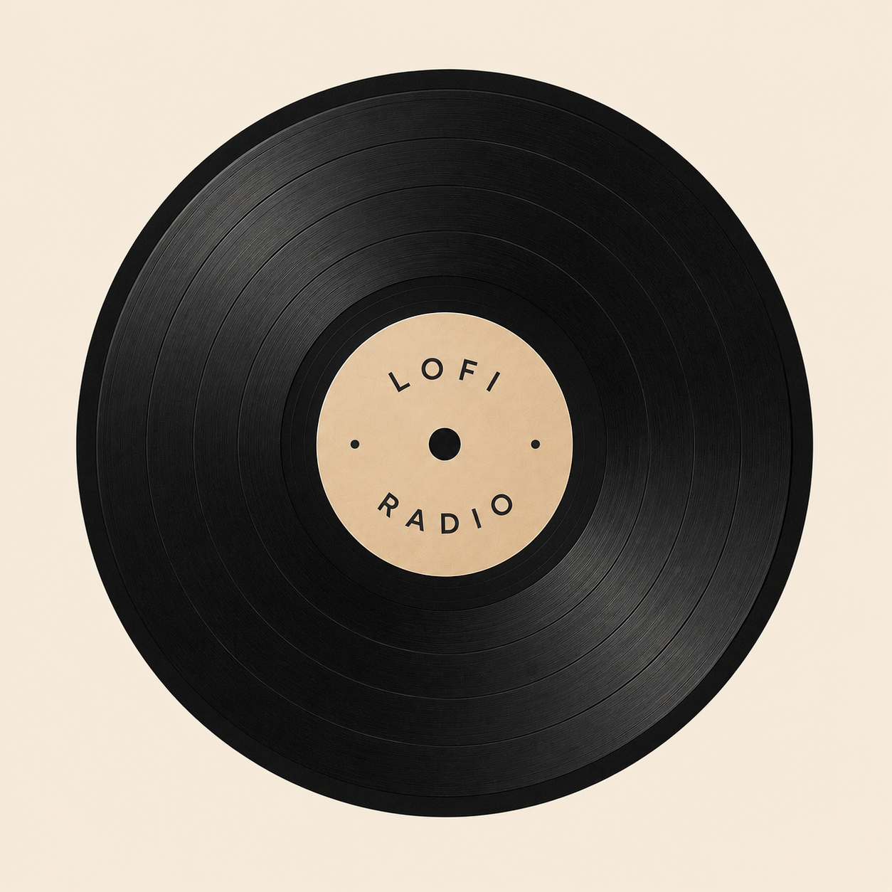
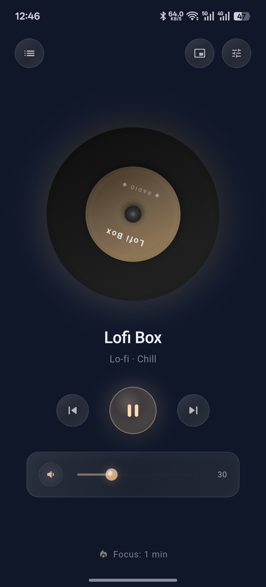
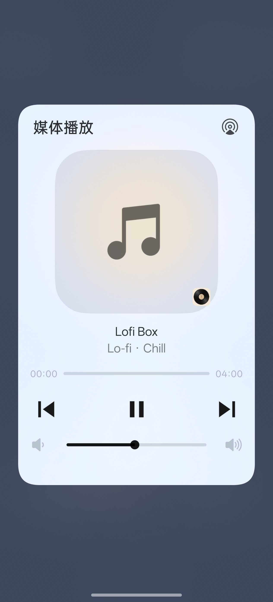
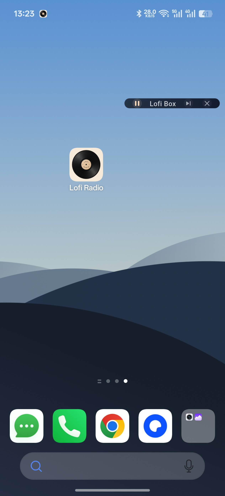
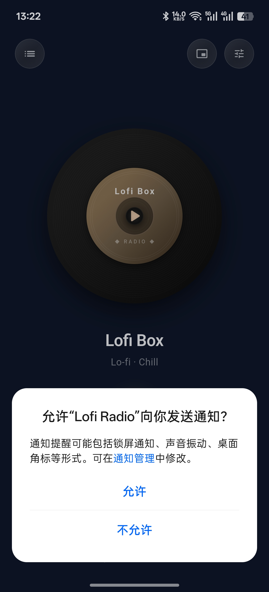
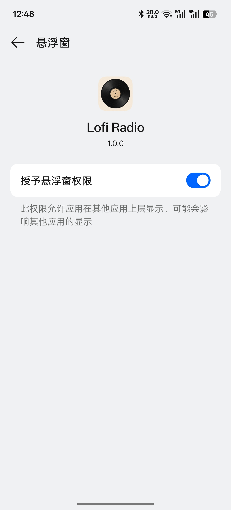
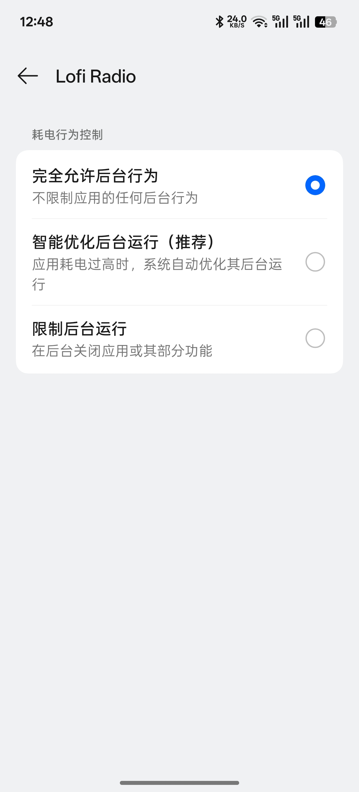

  
  <h1>Lofi Radio Flutter</h1>
  
极简 · 沉浸 · 开箱即用的安卓电台

  

    
    
  

---

为了扩展优秀项目 [lofi radio](https://github.com/labilio/lofi-radio) 的移动端支持，制作了此 Flutter 版本。继承原版沉浸、黑胶、深色的设计语言，专注于安卓端的 UI/UX 体验。

## 下载

[→ 前往 Release 页面下载 APK](https://github.com/WEP-56/Lofi-Radio_flutter/releases)

## 截图

<table>
  <tr>
    <td align="center"> 极简厚重的主界面</td>
    <td align="center"> 连通设备媒体的通知栏</td>
    <td align="center"> 零侵入单行悬浮窗</td>
  </tr>
</table>

## 功能

- 🎵 15+ 预设电台（Lo-Fi / Chill / Jazz / Classical / Hip-Hop）
- 💿 黑胶唱片动画 — 旋转、光晕、纹路、电台名标签
- 🔔 通知栏媒体控制 — 播放/暂停/切台，锁屏可用
- 🪟 悬浮窗迷你播放器 — 贴边胶囊，零侵入
- 🔥 Focus 计时器 — 每日自动重置
- 😴 睡眠定时 — 15/30/45/60/90 分钟可选
- ➕ 自定义电台 — 支持 mp3/m3u8 流媒体链接
- 🎨 深夜学霸主题 — 深靛蓝 + 暖铜色，玻璃质感控件

## 使用提示

<table>
  <tr>
    <td align="center"> 1. 接受通知权限</td>
    <td align="center"> 2. 同意悬浮窗权限</td>
    <td align="center"> 3. 修改耗电行为（推荐）</td>
  </tr>
</table>

## 需要 Windows / Mac 版？

直接前往 [lofi radio](https://github.com/labilio/lofi-radio) 获得优秀的 PC 电台体验。

## 寻找更多电台？

Lofi Radio Flutter 支持添加 m3u8、mp3 链接自定义电台，试试在这里寻找：

- [recommended-radio-streams](https://github.com/deroverda/recommended-radio-streams)
- [radio-browser-api](https://github.com/ivandotv/radio-browser-api)

## License

[MIT](LICENSE)
